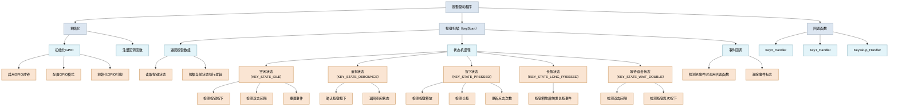

```mermaid
graph TD
    A[按键驱动程序] --> B[初始化]
    A --> C[按键扫描（keyScan）]
    A --> D[回调函数]

    B --> B1[初始化GPIO]
    B --> B2[注册回调函数]

    B1 --> B1a[启用GPIO时钟]
    B1 --> B1b[配置GPIO模式]
    B1 --> B1c[初始化GPIO引脚]

    C --> C1[遍历按键数组]
    C --> C2[状态机逻辑]
    C --> C3[事件回调]

    C1 --> C1a[读取按键状态]
    C1 --> C1b[根据当前状态执行逻辑]

    C2 --> C2a[空闲状态（KEY_STATE_IDLE）]
    C2 --> C2b[消抖状态（KEY_STATE_DEBOUNCE）]
    C2 --> C2c[按下状态（KEY_STATE_PRESSED）]
    C2 --> C2d[长按状态（KEY_STATE_LONG_PRESSED）]
    C2 --> C2e[等待双击状态（KEY_STATE_WAIT_DOUBLE）]

    C2a --> C2a1[检测按键按下]
    C2a --> C2a2[检测双击间隔]
    C2a --> C2a3[重置事件]

    C2b --> C2b1[确认按键按下]
    C2b --> C2b2[返回空闲状态]

    C2c --> C2c1[检测按键释放]
    C2c --> C2c2[检测长按]
    C2c --> C2c3[更新点击次数]

    C2d --> C2d1[按键释放后触发长按事件]

    C2e --> C2e1[检测双击间隔]
    C2e --> C2e2[检测按键再次按下]

    C3 --> C3a[检测到事件时调用回调函数]
    C3 --> C3b[清除事件标志]

    D --> D1[Key0_Handler]
    D --> D2[Key1_Handler]
    D --> D3[Keywkup_Handler]

    %% 核心模块（浅蓝灰）
    style A fill:#DCE6F1,stroke:#AAB8C5,stroke-width:2px,color:#000
    style B fill:#DCE6F1,stroke:#AAB8C5,stroke-width:2px,color:#000
    style C fill:#DCE6F1,stroke:#AAB8C5,stroke-width:2px,color:#000
    style D fill:#DCE6F1,stroke:#AAB8C5,stroke-width:2px,color:#000

    %% 次级模块（浅青色）
    style B1 fill:#E3F4F9,stroke:#A2C3CD,stroke-width:2px,color:#000
    style B2 fill:#E3F4F9,stroke:#A2C3CD,stroke-width:2px,color:#000
    style C1 fill:#E3F4F9,stroke:#A2C3CD,stroke-width:2px,color:#000
    style C2 fill:#E3F4F9,stroke:#A2C3CD,stroke-width:2px,color:#000
    style C3 fill:#E3F4F9,stroke:#A2C3CD,stroke-width:2px,color:#000
    style D1 fill:#E3F4F9,stroke:#A2C3CD,stroke-width:2px,color:#000
    style D2 fill:#E3F4F9,stroke:#A2C3CD,stroke-width:2px,color:#000
    style D3 fill:#E3F4F9,stroke:#A2C3CD,stroke-width:2px,color:#000

    %% 叶子节点（淡橙色）
    style B1a fill:#FAE5D3,stroke:#D5A878,stroke-width:2px,color:#000
    style B1b fill:#FAE5D3,stroke:#D5A878,stroke-width:2px,color:#000
    style B1c fill:#FAE5D3,stroke:#D5A878,stroke-width:2px,color:#000
    style C1a fill:#FAE5D3,stroke:#D5A878,stroke-width:2px,color:#000
    style C1b fill:#FAE5D3,stroke:#D5A878,stroke-width:2px,color:#000
    style C2a fill:#FAE5D3,stroke:#D5A878,stroke-width:2px,color:#000
    style C2b fill:#FAE5D3,stroke:#D5A878,stroke-width:2px,color:#000
    style C2c fill:#FAE5D3,stroke:#D5A878,stroke-width:2px,color:#000
    style C2d fill:#FAE5D3,stroke:#D5A878,stroke-width:2px,color:#000
    style C2e fill:#FAE5D3,stroke:#D5A878,stroke-width:2px,color:#000
    style C2a1 fill:#FAE5D3,stroke:#D5A878,stroke-width:2px,color:#000
    style C2a2 fill:#FAE5D3,stroke:#D5A878,stroke-width:2px,color:#000
    style C2a3 fill:#FAE5D3,stroke:#D5A878,stroke-width:2px,color:#000
    style C2b1 fill:#FAE5D3,stroke:#D5A878,stroke-width:2px,color:#000
    style C2b2 fill:#FAE5D3,stroke:#D5A878,stroke-width:2px,color:#000
    style C2c1 fill:#FAE5D3,stroke:#D5A878,stroke-width:2px,color:#000
    style C2c2 fill:#FAE5D3,stroke:#D5A878,stroke-width:2px,color:#000
    style C2c3 fill:#FAE5D3,stroke:#D5A878,stroke-width:2px,color:#000
    style C2d1 fill:#FAE5D3,stroke:#D5A878,stroke-width:2px,color:#000
    style C2e1 fill:#FAE5D3,stroke:#D5A878,stroke-width:2px,color:#000
    style C2e2 fill:#FAE5D3,stroke:#D5A878,stroke-width:2px,color:#000
    style C3a fill:#FAE5D3,stroke:#D5A878,stroke-width:2px,color:#000
    style C3b fill:#FAE5D3,stroke:#D5A878,stroke-width:2px,color:#000
```