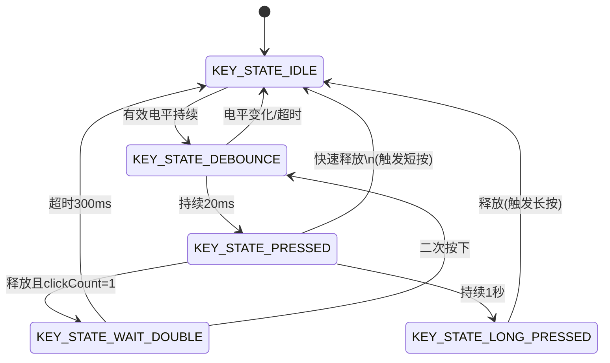

```mermaid
stateDiagram-v2
    direction TB
    [*] --> KEY_STATE_IDLE
    KEY_STATE_IDLE --> KEY_STATE_DEBOUNCE: 有效电平持续
    KEY_STATE_DEBOUNCE --> KEY_STATE_IDLE: 电平变化/超时
    KEY_STATE_DEBOUNCE --> KEY_STATE_PRESSED: 持续20ms
    
    KEY_STATE_PRESSED --> KEY_STATE_IDLE: 快速释放\n(触发短按)
    KEY_STATE_PRESSED --> KEY_STATE_WAIT_DOUBLE: 释放且clickCount=1
    KEY_STATE_PRESSED --> KEY_STATE_LONG_PRESSED: 持续1秒
    
    KEY_STATE_WAIT_DOUBLE --> KEY_STATE_IDLE: 超时300ms
    KEY_STATE_WAIT_DOUBLE --> KEY_STATE_DEBOUNCE: 二次按下
    
    KEY_STATE_LONG_PRESSED --> KEY_STATE_IDLE: 释放(触发长按)

    %% 状态节点配色规范
    classDef stateStyle fill:#E3F4F9,stroke:#A2C3CD,stroke-width:2px;
    class KEY_STATE_IDLE,KEY_STATE_DEBOUNCE,KEY_STATE_PRESSED,KEY_STATE_LONG_PRESSED,KEY_STATE_WAIT_DOUBLE stateStyle;
```