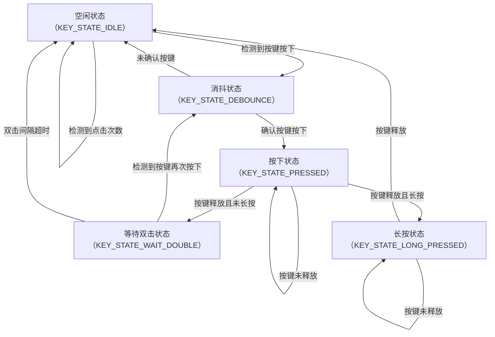

```mermaid
graph TD
    A[空闲状态（KEY_STATE_IDLE）] -->|检测到按键按下| B[消抖状态（KEY_STATE_DEBOUNCE）]
    B -->|确认按键按下| C[按下状态（KEY_STATE_PRESSED）]
    B -->|未确认按键| A
    C -->|按键释放且未长按| D[等待双击状态（KEY_STATE_WAIT_DOUBLE）]
    C -->|按键释放且长按| E[长按状态（KEY_STATE_LONG_PRESSED）]
    C -->|按键未释放| C
    D -->|检测到按键再次按下| B
    D -->|双击间隔超时| A
    E -->|按键释放| A
    E -->|按键未释放| E
    A -->|检测到双击间隔超时| A
    A -->|检测到点击次数| A
```