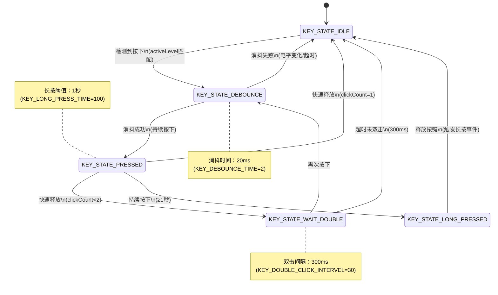

```mermaid
stateDiagram-v2
    [*] --> KEY_STATE_IDLE
    KEY_STATE_IDLE --> KEY_STATE_DEBOUNCE: 检测到按下\n(activeLevel匹配)
    KEY_STATE_DEBOUNCE --> KEY_STATE_IDLE: 消抖失败\n(电平变化/超时)
    KEY_STATE_DEBOUNCE --> KEY_STATE_PRESSED: 消抖成功\n(持续按下)
    KEY_STATE_PRESSED --> KEY_STATE_IDLE: 快速释放\n(clickCount=1)
    KEY_STATE_PRESSED --> KEY_STATE_WAIT_DOUBLE: 快速释放\n(clickCount<2)
    KEY_STATE_PRESSED --> KEY_STATE_LONG_PRESSED: 持续按下\n(≥1秒)
    KEY_STATE_WAIT_DOUBLE --> KEY_STATE_IDLE: 超时未双击\n(300ms)
    KEY_STATE_WAIT_DOUBLE --> KEY_STATE_DEBOUNCE: 再次按下
    KEY_STATE_LONG_PRESSED --> KEY_STATE_IDLE: 释放按键\n(触发长按事件)
    
    note right of KEY_STATE_DEBOUNCE
        消抖时间：20ms
        (KEY_DEBOUNCE_TIME=2)
    end note
    
    note left of KEY_STATE_PRESSED
        长按阈值：1秒
        (KEY_LONG_PRESS_TIME=100)
    end note
    
    note right of KEY_STATE_WAIT_DOUBLE
        双击间隔：300ms
        (KEY_DOUBLE_CLICK_INTERVEL=30)
    end note
```