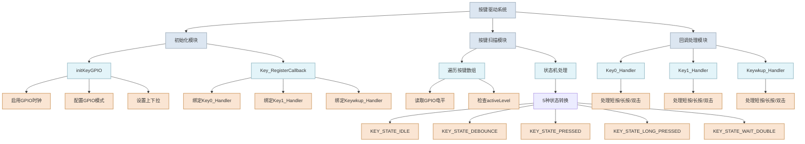

```mermaid
graph TD
    A[按键驱动系统] --> B[初始化模块]
    A --> C[按键扫描模块]
    A --> D[回调处理模块]

    B --> B1[initKeyGPIO]
    B --> B2[Key_RegisterCallback]
    B1 --> B1a[启用GPIO时钟]
    B1 --> B1b[配置GPIO模式]
    B1 --> B1c[设置上下拉]
    B2 --> B2a[绑定Key0_Handler]
    B2 --> B2b[绑定Key1_Handler]
    B2 --> B2c[绑定Keywkup_Handler]

    C --> C1[遍历按键数组]
    C --> C2[状态机处理]
    C1 --> C1a[读取GPIO电平]
    C1 --> C1b[检查activeLevel]
    C2 --> C2a[5种状态转换]
    C2a --> C2a1[KEY_STATE_IDLE]
    C2a --> C2a2[KEY_STATE_DEBOUNCE]
    C2a --> C2a3[KEY_STATE_PRESSED]
    C2a --> C2a4[KEY_STATE_LONG_PRESSED]
    C2a --> C2a5[KEY_STATE_WAIT_DOUBLE]

    D --> D1[Key0_Handler]
    D --> D2[Key1_Handler]
    D --> D3[Keywkup_Handler]
    D1 --> D1a[处理短按/长按/双击]
    D2 --> D2a[处理短按/长按/双击]
    D3 --> D3a[处理短按/长按/双击]

    %% 核心模块配色
    style A fill:#DCE6F1,stroke:#AAB8C5,stroke-width:2px
    style B fill:#DCE6F1,stroke:#AAB8C5,stroke-width:2px
    style C fill:#DCE6F1,stroke:#AAB8C5,stroke-width:2px
    style D fill:#DCE6F1,stroke:#AAB8C5,stroke-width:2px

    %% 次级模块配色
    style B1 fill:#E3F4F9,stroke:#A2C3CD,stroke-width:2px
    style B2 fill:#E3F4F9,stroke:#A2C3CD,stroke-width:2px
    style C1 fill:#E3F4F9,stroke:#A2C3CD,stroke-width:2px
    style C2 fill:#E3F4F9,stroke:#A2C3CD,stroke-width:2px
    style D1 fill:#E3F4F9,stroke:#A2C3CD,stroke-width:2px
    style D2 fill:#E3F4F9,stroke:#A2C3CD,stroke-width:2px
    style D3 fill:#E3F4F9,stroke:#A2C3CD,stroke-width:2px

    %% 叶子节点配色
    style B1a fill:#FAE5D3,stroke:#D5A878,stroke-width:2px
    style B1b fill:#FAE5D3,stroke:#D5A878,stroke-width:2px
    style B1c fill:#FAE5D3,stroke:#D5A878,stroke-width:2px
    style B2a fill:#FAE5D3,stroke:#D5A878,stroke-width:2px
    style B2b fill:#FAE5D3,stroke:#D5A878,stroke-width:2px
    style B2c fill:#FAE5D3,stroke:#D5A878,stroke-width:2px
    style C1a fill:#FAE5D3,stroke:#D5A878,stroke-width:2px
    style C1b fill:#FAE5D3,stroke:#D5A878,stroke-width:2px
    style C2a1 fill:#FAE5D3,stroke:#D5A878,stroke-width:2px
    style C2a2 fill:#FAE5D3,stroke:#D5A878,stroke-width:2px
    style C2a3 fill:#FAE5D3,stroke:#D5A878,stroke-width:2px
    style C2a4 fill:#FAE5D3,stroke:#D5A878,stroke-width:2px
    style C2a5 fill:#FAE5D3,stroke:#D5A878,stroke-width:2px
    style D1a fill:#FAE5D3,stroke:#D5A878,stroke-width:2px
    style D2a fill:#FAE5D3,stroke:#D5A878,stroke-width:2px
    style D3a fill:#FAE5D3,stroke:#D5A878,stroke-width:2px
```