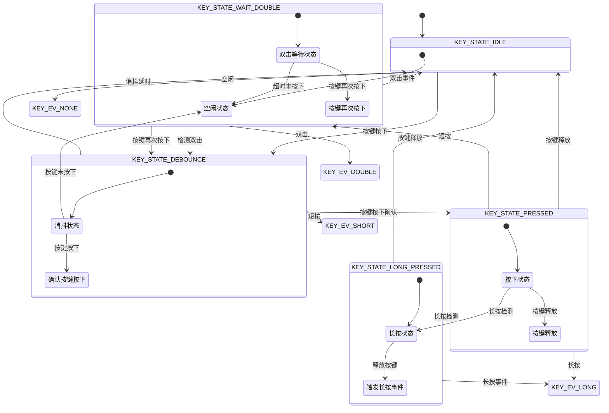

```mermaid
stateDiagram-v2
    [*] --> KEY_STATE_IDLE
    KEY_STATE_IDLE --> KEY_STATE_DEBOUNCE : 按键按下
    KEY_STATE_DEBOUNCE --> KEY_STATE_IDLE : 消抖延时
    KEY_STATE_DEBOUNCE --> KEY_STATE_PRESSED : 按键按下确认
    KEY_STATE_PRESSED --> KEY_STATE_LONG_PRESSED : 长按检测
    KEY_STATE_PRESSED --> KEY_STATE_IDLE : 按键释放
    KEY_STATE_PRESSED --> KEY_STATE_WAIT_DOUBLE : 短按
    KEY_STATE_LONG_PRESSED --> KEY_STATE_IDLE : 按键释放
    KEY_STATE_WAIT_DOUBLE --> KEY_STATE_DEBOUNCE : 检测双击
    KEY_STATE_WAIT_DOUBLE --> KEY_STATE_IDLE : 双击事件
    KEY_STATE_WAIT_DOUBLE --> KEY_STATE_DEBOUNCE : 按键再次按下
    
    %% 状态机内部细节
    state KEY_STATE_IDLE {
        [*] --> 空闲状态
    }

    state KEY_STATE_DEBOUNCE {
        [*] --> 消抖状态
        消抖状态 --> 确认按键按下 : 按键按下
        消抖状态 --> 空闲状态 : 按键未按下
    }

    state KEY_STATE_PRESSED {
        [*] --> 按下状态
        按下状态 --> 长按状态 : 长按检测
        按下状态 --> 按键释放 : 按键释放
    }

    state KEY_STATE_LONG_PRESSED {
        [*] --> 长按状态
        长按状态 --> 触发长按事件 : 释放按键
    }

    state KEY_STATE_WAIT_DOUBLE {
        [*] --> 双击等待状态
        双击等待状态 --> 按键再次按下 : 按键再次按下
        双击等待状态 --> 空闲状态 : 超时未按下
    }

    %% 事件处理
    KEY_STATE_IDLE --> KEY_EV_NONE : 空闲
    KEY_STATE_DEBOUNCE --> KEY_EV_SHORT : 短按
    KEY_STATE_PRESSED --> KEY_EV_LONG : 长按
    KEY_STATE_WAIT_DOUBLE --> KEY_EV_DOUBLE : 双击
    KEY_STATE_LONG_PRESSED --> KEY_EV_LONG : 长按事件
```