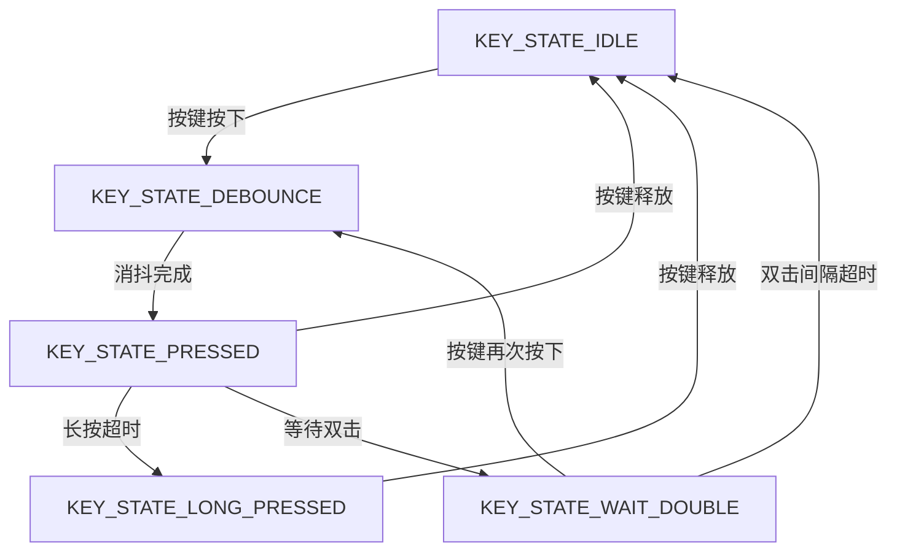

```mermaid
graph TD
    A[KEY_STATE_IDLE] -->|按键按下| B[KEY_STATE_DEBOUNCE]
    B -->|消抖完成| C[KEY_STATE_PRESSED]
    C -->|按键释放| A
    C -->|长按超时| D[KEY_STATE_LONG_PRESSED]
    D -->|按键释放| A
    C -->|等待双击| E[KEY_STATE_WAIT_DOUBLE]
    E -->|双击间隔超时| A
    E -->|按键再次按下| B
```