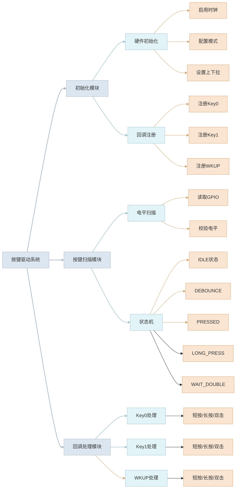

```mermaid

    graph LR
    A[按键驱动系统] --> B[初始化模块]
    A --> C[按键扫描模块]
    A --> D[回调处理模块]

    B --> B1[硬件初始化]
    B --> B2[回调注册]
    C --> C1[电平扫描]
    C --> C2[状态机]
    D --> D1[Key0处理]
    D --> D2[Key1处理]
    D --> D3[WKUP处理]

    B1 --> B1a[启用时钟]
    B1 --> B1b[配置模式]
    B1 --> B1c[设置上下拉]
    B2 --> B2a[注册Key0]
    B2 --> B2b[注册Key1]
    B2 --> B2c[注册WKUP]

    C1 --> C1a[读取GPIO]
    C1 --> C1b[校验电平]
    C2 --> C2a[IDLE状态]
    C2 --> C2b[DEBOUNCE]
    C2 --> C2c[PRESSED]
    C2 --> C2d[LONG_PRESS]
    C2 --> C2e[WAIT_DOUBLE]

    D1 --> D1a[短按/长按/双击]
    D2 --> D2a[短按/长按/双击]
    D3 --> D3a[短按/长按/双击]

    %% 严格层级配色控制
    classDef L1 fill:#DCE6F1,stroke:#AAB8C5;
    classDef L2 fill:#E3F4F9,stroke:#A2C3CD;
    classDef L3 fill:#FAE5D3,stroke:#D5A878;

    class A,B,C,D L1;
    class B1,B2,C1,C2,D1,D2,D3 L2;
    class B1a,B1b,B1c,B2a,B2b,B2c,C1a,C1b,C2a,C2b,C2c,C2d,C2e,D1a,D2a,D3a L3;

    %% 手动调整节点位置防止重叠
    linkStyle 0,1,2 stroke:#AAB8C5,stroke-width:2px
    linkStyle 3,4,5,6,7,8 stroke:#A2C3CD,stroke-width:1.5px
    linkStyle 9,10,11,12,13,14,15,16,17,18,19,20 stroke:#D5A878,stroke-width:1px
```